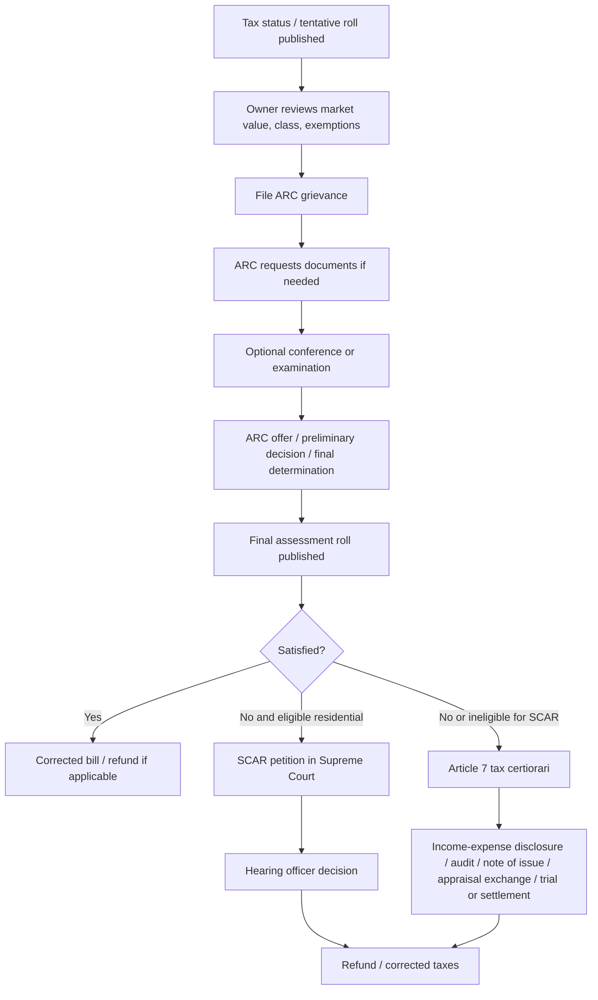

# Nassau County Property Tax Grievance Process

## Executive Summary

In entity["place","Nassau County","new york, us"], property-tax grievances do **not** follow the ordinary “fourth Tuesday in May Grievance Day” model used in most New York municipalities. Instead, Nassau uses a special statutory framework centered on the county’s entity["organization","Assessment Review Commission","nassau county property review"], which accepts applications during a filing window that runs from the **first business day in January to the first business day in March**, reviews them throughout the year, and feeds corrections into a **final roll published on April 1 of the following calendar year**. That administrative track is grounded primarily in RPTL § 523-b and Nassau’s ARC rules; judicial review then branches to either **SCAR** for eligible owner-occupied residential property or a full **Article 7 tax certiorari** proceeding in Supreme Court. citeturn4view2turn14view0turn15view1turn16view2turn29view0turn28view0turn19view0

For the 2027/28 Nassau tax year, the county’s published calendar shows: **tax status date and tentative roll: January 2, 2026; standard grievance due date: March 2, 2026; final roll: April 1, 2027; judicial-review petitions due: April 30, 2027**. However, Nassau’s ARC homepage, AROW portal, and 2027/28 brochure also posted a **2026 extension to March 31, 2026**, while other county pages still showed March 2. The safest legal reading is that the baseline rule remains “first business day in March,” but practitioners should always check the ARC homepage and AROW banner for year-specific extensions. As of **May 3, 2026**, the 2026 filing period is closed. citeturn4view0turn33view0turn34search0turn10view3turn2view1

At the administrative stage, Nassau is comparatively accessible: **there is no ARC filing fee**, online filing through AROW is encouraged, paper filing is still allowed, and an attorney is **not** required. The county will not increase the assessment as a result of a grievance. But the process becomes much more formal after ARC: SCAR has a statutory filing fee and strict service rules; Article 7 has statute-of-limitations, service, disclosure, income/expense, note-of-issue, and appraisal requirements that make it materially more complex. citeturn2view1turn11view0turn10view3turn19view3turn20view0turn21view0turn28view0turn28view2turn24view1turn24view3turn30view1turn30view2

The strongest automation opportunity is **not** “fully autonomous litigation.” It is a **semi-automated workflow**: intake, parcel-data pull, deadline engine, comparable-sale package, form generation, evidence checklisting, mailing/service tracking, and dashboarding around ARC and SCAR. Fully automating Article 7 end-to-end is generally **not feasible** without licensed attorney oversight, appraisal support, and careful controls against unauthorized practice of law. That is especially true because New York permits non-attorney representatives at the administrative level, but not as representatives for Article 7 court proceedings. citeturn30view0turn30view2turn24view1turn24view3

## Legal Framework

The statewide framework comes from the Real Property Tax Law of entity["state","New York","us state"]. For ordinary municipalities, administrative review is handled through a Board of Assessment Review and the complaint process under Article 5, but Nassau is expressly allowed to substitute the ARC model under **RPTL § 523-b**. That statute authorizes Nassau to use an assessment review commission “as an alternative to section 523,” establishes the commission’s role in reviewing and correcting assessments, allows electronic filing, requires a verified application, allows the commission to compel examinations, and sets the basic filing period from **January 2 through March 1** as later adapted by county rules to “first business day” mechanics. citeturn14view0turn15view1turn16view2

Nassau’s own ARC rules are operationally important because they fill in the day-to-day procedures. They state that the **sole procedure** before the commission is the application for correction under RPTL § 523-b; that applications are filed during the period from the **first business day in January until the first business day in March**; that traditional assessor hearing and Grievance Day procedures do **not** apply to ARC; that ARC acts throughout the year; and that ARC applications must use Nassau forms AR1, AR2, or AR3. The rules also make written authorization mandatory for representatives and limit that authorization to **one tentative assessment roll** signed no more than **120 days** before the filing window opens. citeturn4view2turn5view2

If ARC relief is denied or insufficient, judicial review splits into two tracks. The first is **SCAR**, governed by **RPTL Title 1-A of Article 7** and administered through the entity["organization","New York State Unified Court System","state courts"]. SCAR is limited to eligible owner-occupied residential property and certain Class One condominiums in Nassau. The second is a full **Article 7 tax certiorari** proceeding under RPTL Article 7, which is the route for commercial property and for residential owners who choose not to use SCAR. citeturn19view0turn19view1turn19view2turn28view0turn28view1

For Article 7 practice specifically, the most important court rule is **22 NYCRR 202.59**, which applies in counties outside New York City. It requires service of either a statement that the property is not income-producing or a verified/certified income-and-expense statement before a note of issue may be filed, allows an audit request, governs pretrial conferences, and tightly regulates exchange and use of appraisal reports. These rules matter most in commercial cases and are the main reason full tax certiorari is much harder to automate or handle without counsel. citeturn24view0turn24view1turn24view2turn24view3

## Calendar and Lifecycle

Nassau’s calendar is unusual enough that it is worth stating plainly: the grievance you file in early 2026 concerns the **2027/28** county assessment roll and affects later tax bills. Nassau’s 2027/28 brochure says the assessor publishes the tentative roll on **January 2, 2026**; ARC filing runs **January 2, 2026 to March 2, 2026**; ARC reviews run through **March 31, 2027**; the final assessment roll is published **April 1, 2027**; and the last day for judicial review is **April 30, 2027**. The brochure also says that filing the 2027/28 application affects the **October 2027 school tax bill** and **January 2028 general tax bill**. Nassau’s assessment-review dates page is consistent on January 2, 2026, April 1, 2027, and April 30, 2027. citeturn33view0turn4view0

The baseline computation rule is straightforward. Under ARC rules, filing opens on the **first business day in January** and closes on the **first business day in March**. For years in which January 2 or March 1 falls on a weekend or holiday, the practical filing dates move to the next business day. Under Article 7’s general statute, judicial review must be commenced within **30 days** after the final completion and filing of the assessment roll, and the roll is deemed finally filed on the **later** of the last date allowed by law or the date notice of filing is given. Nassau’s special statute also says review of a final ARC determination must be commenced by the **last business day of April after the final roll** or within **30 days after notice of final determination**. citeturn4view2turn28view0turn16view2turn16view3

A material caution: Nassau’s 2026 official materials were **internally inconsistent** on the grievance deadline. ARC’s home page and AROW banner said the filing period was **extended to March 31, 2026**; the AROW home page also repeated that extension; but the “How to Appeal” page and the county dates page still stated **March 2, 2026**. For future years, the safest operational rule is: follow the published “first business day in March” rule **unless** ARC posts a later extension on its primary home page or AROW portal. citeturn34search0turn10view3turn2view1turn4view0

### Key date table

| Stage | Nassau standard rule | 2027/28 cycle example |
|---|---|---|
| Tax status / valuation date | January 2 of filing year | January 2, 2026 |
| Tentative assessment roll | January 2 of filing year | January 2, 2026 |
| ARC grievance filing opens | First business day in January | January 2, 2026 |
| ARC grievance filing closes | First business day in March | March 2, 2026 standard; ARC also posted March 31, 2026 extension |
| ARC review period | Continues through following year | March 2026 through March 2027 |
| Final assessment roll | April 1 of following year | April 1, 2027 |
| SCAR / Article 7 filing | Within 30 days after final roll filing / notice; Nassau materials show April 30 | April 30, 2027 |

Source note: Nassau County assessment review dates, brochure, ARC rules, and the RPTL Article 7 limitations rule support this table. citeturn4view0turn33view0turn4view2turn28view0turn16view3

### Grievance lifecycle flowchart

The structure above reflects Nassau’s ARC-first administrative process, then branching to SCAR or Article 7 after the final roll. Nassau’s own materials also confirm that a taxpayer may file every year and that the administrative review affects later school and general tax bills. citeturn33view0turn19view3turn20view0turn24view0

## Filing Requirements and Evidence

Nassau uses three primary ARC forms. **AR1** is for value challenges on exclusively residential one-, two-, or three-family homes and **Class 1 condominium units**; **AR2** is for all other property types; and **AR3** is for disputes over **tax class or exemptions**. Online filing through AROW is recommended and allowed for any property type and any claim type, while paper filing remains available by mail or hand delivery to ARC at 240 Old Country Road, 5th Floor, Mineola. citeturn11view1turn4view1turn33view0

For online filing, Nassau’s FAQ says taxpayers can attach **Word documents, spreadsheets, digital photographs, and scanned images**; video files are not accepted. If you cannot upload documents electronically, you may mail them separately with a cover sheet referencing the application and the parcel ID. ARC’s brochure says the minimum practical inputs for filing are your contact information, the property address or parcel ID, your estimate of market value, and a valid email address. citeturn11view2turn33view0

A critical Nassau nuance is that ARC does **not** require comparable sales or appraisal reports as a condition of review in the same way many taxpayers assume. ARC’s rules expressly say that **submission of comparable-property information is not required**, and **appraisal reports are not required** except for final reports previously exchanged in prior assessment review proceedings relating to the subject property. That said, ARC also makes clear that taxpayers may submit such material voluntarily, and in practice well-organized comparable sales, photographs, and appraisals can still strengthen a case. citeturn6view0

For residential valuation claims, the standard request is the information called for in **Part C of AR1**, plus—in construction cases—a copy of the permit application or certificate of occupancy and an itemized record of construction costs. For commercial and other nonresidential property, the standard request is much heavier: **Part C of AR2**, rent rolls, itemized income-and-expense statements, cooperative/condominium financial statements, offering-plan amendments, hotel or assisted-living operating statements, lease abstracts or copies, contracts of sale and closings, entire-building leases, construction cost records, and plans concerning environmental contamination, structural defects, or code violations. Failure to provide required information can lead ARC to deny the application or compel an examination. citeturn6view2turn7view0turn7view1turn7view2

Exemption appeals are narrower. Nassau’s ARC FAQ says ARC’s jurisdiction over exemption cases is **appellate only**: the exemption must first be decided by the county’s entity["organization","Department of Assessment","nassau county assessor"], and ARC will consider only the record that was already submitted to that department. ARC cannot accept new evidence that was not previously provided to the Department of Assessment. That is a major procedural trap for exemption applicants. citeturn4view1

### Evidence matrix

| Evidence type | ARC residential | ARC commercial / condo / income-producing | SCAR | Article 7 |
|---|---|---|---|---|
| Owner opinion of market value | Core filing input | Useful but usually insufficient alone | Core petition field | Useful, but litigation usually needs more |
| Comparable sales | Optional, not required by ARC rule | Optional; may help in valuation theory | Explicitly contemplated on petition | Common in appraisals / reports |
| Photos / scans | Uploadable in AROW | Uploadable in AROW | Can be attached as supporting records | Common exhibit material |
| Deed / proof of authority | Useful if ownership/standing is unclear | Useful if ownership/standing is unclear | Representative designation if filing for owner | Standing and representation matter |
| Income/expense statements | Usually not central for owner-occupied homes | Often required | Usually not central for owner-occupied homes | Required for income-producing property before note of issue |
| Appraisal report | Optional at ARC | Optional at ARC; often strategically valuable | Helpful but not mandatory | Practically important if expert testimony on value will be offered |
| Construction permits / C.O. / cost records | Required in construction cases | Required in construction/expansion cases | Helpful if value dispute involves new work | Commonly relevant |
| Exemption application file | Needed for AR3 exemption appeal | Needed for AR3 exemption appeal | Petition can include exemption claim if eligible residential | Relevant if exemption denial is litigated |

Source note: ARC FAQ and ARC rules establish what is mandatory versus optional at the administrative stage; the SCAR petition form shows what evidence can support a residential claim; 22 NYCRR 202.59 governs income/expense and appraisal practice in Article 7. citeturn11view2turn6view0turn6view2turn7view0turn21view1turn24view1turn24view3

## Procedures and Appeal Paths

The step-by-step ARC process is as follows. First, review the tentative roll when Nassau publishes it in early January and compare the county’s market-value estimate against your own evidence. Second, choose the proper form—AR1, AR2, or AR3—and file through AROW or by paper. Third, upload or assemble supporting evidence. Fourth, monitor for ARC requests, offers, or notices; AROW allows status tracking. Fifth, if ARC asks for more information, answer by the date in the notice or request an extension in writing. Sixth, if needed, request a conference; the rules say ARC will endeavor to grant conferences for complete applications and may conduct conferences by telephone. Seventh, evaluate any settlement offer or final determination, and decide whether to stop or move to SCAR or Article 7. citeturn2view1turn10view3turn11view0turn6view0turn7view2turn7view3turn5view5

ARC procedures are less formal than court practice, but they are not consequence-free. ARC may deny an application if the filer does not cure defects after notice, fails to provide required information, refuses an examination, or willfully denies a noticed property inspection. Duplicate authorizations can also cause a grievance to be denied. These are among the most avoidable failure modes. citeturn6view0turn7view0turn14view0turn2view1

SCAR is the simpler judicial route, but it is only for eligible property. It is available to owners of one-, two-, or three-family owner-occupied residential property and certain owner-occupied **Class One condominiums in Nassau**. The owner must already have filed the ARC complaint. The SCAR petition must be filed within **30 days** after the final assessment roll, with a **$30 filing fee**, and the petitioner must serve copies on the assessing unit and other required recipients within ten days. The hearing is informal, before a hearing officer, and the owner may appear personally, with an attorney, or through a representative designated in writing. Filing SCAR waives the right to commence a regular Article 7 proceeding for the same assessment. citeturn19view0turn19view1turn19view2turn20view0turn21view0turn21view1

Article 7 tax certiorari is the full judicial route. It is filed in Supreme Court in the judicial district where the property is located, generally within **30 days** after final roll filing or notice, whichever is later. Three copies of the notice of petition and petition must be served on the municipality, and copies must also be mailed to the county treasurer, relevant school district, and sometimes a village clerk. The petitioner may represent themselves, but **may not designate a non-attorney** to represent them in the Article 7 proceeding. For income-producing property, income-and-expense disclosures, audits, note-of-issue rules, and appraisal exchanges under 22 NYCRR 202.59 become central. citeturn28view0turn28view1turn28view2turn30view1turn30view2turn24view1turn24view3

### SCAR versus Article 7

| Question | SCAR | Article 7 tax certiorari |
|---|---|---|
| Who can use it? | Eligible owner-occupied residential property; Nassau Class One condos included | Any aggrieved property owner with standing, including commercial property |
| Filing fee | $30 per current statute and current instructions | Court filing/service costs apply; current official clerk-fee schedule was not separately verified in this research |
| Representation | Owner, attorney, or other designated representative | Owner may self-represent; non-attorney representative is not permitted |
| Procedure | Informal hearing before hearing officer | Formal Supreme Court special proceeding |
| Evidence burden | Still on petitioner, but procedurally lighter | Much heavier; appraisal and income/expense practice often decisive |
| Strategic effect | Waives regular Article 7 route for same assessment | Preserves full litigation path |

Source note: SCAR eligibility, fee, service, and waiver rules come from RPTL § 730 and the current UCS petition instructions; Article 7 representation and procedural complexity are described in the state tax department’s certiorari publication and Uniform Rule 202.59. citeturn19view0turn20view0turn21view0turn30view1turn30view2turn24view1turn24view3

## Costs, Representation, Outcomes, and Risks

The **officially fixed** costs are clear at the front end: ARC filing is **free**. SCAR requires a **$30 filing fee**, and the e-filing guide for counties outside New York City states a **$0.90 service fee** for NYSCEF e-filing. Both SCAR and Article 7 create additional mailing/copying or service costs because multiple copies must be served or mailed to specified recipients. ARC also permits paper filing and separate mailing of evidence, so even the “free” path can carry incidental admin costs. citeturn2view1turn20view0turn21view0turn11view2turn30view1

Private professional costs are **not set by statute** and are not published in the official Nassau/State materials reviewed here. What the official sources do show is the dividing line on who can appear: at the ARC / administrative level, non-attorney representatives are allowed; in SCAR, the owner may use a representative designated in writing; but in Article 7, a non-attorney cannot represent the taxpayer, though a taxpayer may always appear pro se. In practical terms, that means commercial Article 7 cases usually entail attorney and often appraiser expense, even though those private fee levels vary by market and engagement. citeturn30view0turn30view2turn19view1turn20view0turn5view2

As to outcomes, I did **not** locate an official public Nassau or state source that publishes success rates by property type—residential, condominium, and commercial—in a way that supports a reliable grant-rate table. Nassau’s ARC homepage says its corrections have produced “substantial savings for the taxpayer,” but it does not publish win-loss ratios. The most defensible conclusion from official material is therefore qualitative: owner-occupied residential properties have the cleanest path because they can use ARC and, if necessary, SCAR; commercial and income-producing property face heavier document burdens and frequently require the full Article 7 route. citeturn2view0turn6view0turn24view1

Refunds are possible if relief is granted. Nassau’s residential stipulation form says that corrected tax bills must be issued and the county treasurer refunds overpaid taxes; for owner-occupied one-, two-, or three-family homes and Class 1 condominium units, interest is payable as provided by **RPTL § 734**. ARC’s rules also say it may resolve the current and prior two tax years’ outstanding challenges together in some circumstances. There is no official source in this research indicating a penalty merely for **losing** a grievance; the main economic downside is wasted time and private costs. citeturn10view2turn15view2

### DIY versus professional support

| Option | Official fees | Private fees | Time burden | Likely fit | Success likelihood |
|---|---|---|---|---|---|
| DIY ARC only | $0 | Minimal incidental mailing/copying | Moderate | Simple residential value dispute with decent comps/photos | Medium if facts are strong; depends heavily on evidence quality |
| DIY ARC + SCAR | $0 ARC + $30 SCAR | Minimal incidental mailing/service | Moderate to high | Owner-occupied residential property eligible for SCAR | Medium; stronger than ARC-only when owner is organized and timely |
| DIY Article 7 | Variable court/service costs | Potentially low cash outlay, but high risk | Very high | Rarely sensible except sophisticated self-represented owner | Low to uncertain due procedural complexity |
| ARC with appraiser support | $0 official filing | Appraiser fee variable and market-based | Moderate | Higher-value residential or mixed factual valuation dispute | Often better than DIY where value proof is contested |
| Attorney-led Article 7 | Variable court/service costs | Attorney, appraisal, expert costs variable and market-based | High, but shifted to counsel | Commercial, condo-board, income-producing, or legally complex cases | Highest relative fit for complex property; official win-rate data not published |

The fee ranges in this table are partly **analyst characterization**, because official sources fix only some costs and do not publish market rates for attorneys or appraisers. The legal structure supporting the relative fit and representation columns comes from the cited ARC, SCAR, and Article 7 sources. citeturn2view1turn20view0turn21view0turn30view2turn24view1

### Common denial drivers and pitfalls

The most common legal/process risks visible from the official materials are: filing after deadline; signing duplicate authorizations; using the wrong form; failing to cure defects after notice; failing to provide requested financial records or other required information; refusing inspection or examination; trying to raise new evidence in an exemption appeal that was never submitted to the Department of Assessment; missing SCAR or Article 7 service requirements; and using SCAR without realizing it waives the regular Article 7 remedy. citeturn2view1turn6view0turn14view0turn20view0turn21view0turn28view2turn30view1

## Automation Strategy and Recommended Workflow

The best automation target is an **end-to-end case-management system with human review checkpoints**, not an autonomous legal robot. A practical workflow would do the following: intake the property address and parcel ID; pull assessment, parcel, and map context from Nassau property / GIS sources; calculate the applicable filing window; generate an evidence checklist by property type; assist with comparable-sale assembly; populate AR1/AR2/AR3 or SCAR petition templates; route uploads into a document packet; track ARC notices and deadlines; and manage mail/service tasks for SCAR or Article 7. Nassau’s own ecosystem already exposes several building blocks: AROW for filing/status, Nassau’s property-search ecosystem, an ArcGIS-based Land Record Viewer stack, and state residential assessment ratio / municipal profile resources. citeturn10view3turn33view0turn38search5turn38search1turn29view3

There are also real operational constraints. Nassau’s Land Record Viewer was returning a maintenance page when accessed during this research, which means any production automation should expect downtime and cache non-privileged reference data where permitted. ARC’s online system appears to be form-driven rather than API-documented in the materials reviewed here, which makes browser automation brittle. NYSCEF does support SCAR e-filing, but service obligations still remain after filing. And substantive legal judgment—what grounds to assert, how low a value to request, whether to pick SCAR or Article 7, whether a comparable is truly comparable, whether an income statement is adequate—crosses into legal-analysis territory that should be reviewed by a licensed professional when the stakes are meaningful. citeturn37view0turn10view3turn21view0turn28view1

A recommended end-to-end workflow, assuming no property-specific facts yet, is:

| Step | What to automate | What should stay human-reviewed |
|---|---|---|
| Eligibility and deadline check | Calendar engine, form selection, property-type logic | Final deadline confirmation on ARC/AROW and year-specific notices |
| Data gathering | Parcel lookup, prior assessments, tax districts, RAR/equalization pull | Verification of ownership, exemptions, and unusual parcel structure |
| Evidence prep | Comparable-sale search, photo organizer, document checklist, packet builder | Final comp selection, market-value conclusion, exemption-record completeness |
| ARC filing | Form prefill, PDF export, reminder workflow | Final sign-off; browser filing may need manual intervention |
| ARC post-filing | Status polling, notice digest, deadline reminders | Settlement decision, response arguments, conference presentation |
| SCAR escalation | Petition prefill, service list generation, certified-mail checklist | Final choice to waive Article 7 and proceed via SCAR |
| Article 7 escalation | Petition assembly, service checklist, document repository | Attorney appearance, income/expense statements, appraisals, settlement/trial |

The feasibility assessment is therefore:

- **High feasibility:** intake, calendaring, checklists, packeting, evidence organization, reminder systems.
- **Medium feasibility:** AROW filing assistance, SCAR petition preparation, service tracking, valuation-model support.
- **Low feasibility:** autonomous settlement judgment, autonomous SCAR advocacy, and especially autonomous Article 7 litigation. Those steps create legal, ethical, and licensing problems. citeturn30view2turn24view1turn24view3

### Analyst estimate of implementation effort

These are **analyst estimates**, not official fee schedules:

| Automation scope | Estimated build effort | Main components | Feasibility |
|---|---|---|---|
| MVP grievance assistant | Low six figures or below | intake, deadline engine, template filling, upload organizer, reminder system | Strong |
| Production semi-automated platform | Mid six figures | parcel/GIS integration, valuation support, mail/service, dashboards, audit trail, role-based access | Strong if limited to ARC/SCAR support |
| Fully automated litigation platform | High and ongoing | e-filing orchestration, court workflow, appraisal pipeline, legal review stack, privileged communications controls | Weak / not advisable without law-firm structure |

The decisive compliance issues are unauthorized practice of law, data privacy, records retention, website terms of use, and the hard statutory deadlines that cannot be missed because of system outages or automation errors. citeturn30view2turn24view1turn21view0turn37view0

## Prioritized Sources and Limitations

### Prioritized official sources

1. Nassau County ARC home page and “How to Appeal” page — best source for the county’s actual administrative process, online filing, no-fee policy, representative rules, and warning against duplicate authorizations. citeturn2view0turn2view1  
2. Nassau County ARC rules and county dates table — best source for the **first-business-day** filing rule, the fact that ordinary Grievance Day procedures do not apply, and the 2026/2027 calendar structure. citeturn4view2turn4view0  
3. Nassau County 2027/28 ARC brochure and AROW portal — best source for the real-world 2027/28 lifecycle and the 2026 posted extension conflict. citeturn33view0turn10view3turn34search0  
4. RPTL § 523-b and Article 7 / Title 1-A statute pages — controlling statutory framework for Nassau ARC, SCAR, Article 7 deadlines, and grounds for review. citeturn14view0turn15view1turn16view3turn19view0turn28view0turn28view1turn28view2  
5. New York Courts SCAR pages and current petition/instructions — best source for SCAR eligibility, filing fee, hearing mechanics, and e-filing/service rules. citeturn19view1turn19view2turn20view0turn21view0turn21view1  
6. 22 NYCRR 202.59 — best source for the procedural burden of full Article 7 cases, especially income/expense disclosure, audits, pretrial practice, and appraisal exchange. citeturn24view0turn24view1turn24view3  
7. New York State tax department grievance and certiorari publications — best statewide explanatory source for BAR/SCAR/Article 7 mechanics and for contrasting Nassau with the rest of New York. citeturn29view0turn29view1turn29view2turn30view1  

### Open questions and limitations

I did **not** locate a reliable official public dataset showing Nassau ARC or SCAR **success rates by property type**, so this report does not invent one. I also found a genuine **deadline conflict** in the county’s 2026 materials: March 2 versus March 31. Finally, I did not separately verify the current Supreme Court index-fee schedule for a full Article 7 filing from a clerk-fee source, so Article 7 private/court-cost detail is described qualitatively rather than as a definitive current dollar table. citeturn4view0turn34search0turn10view3